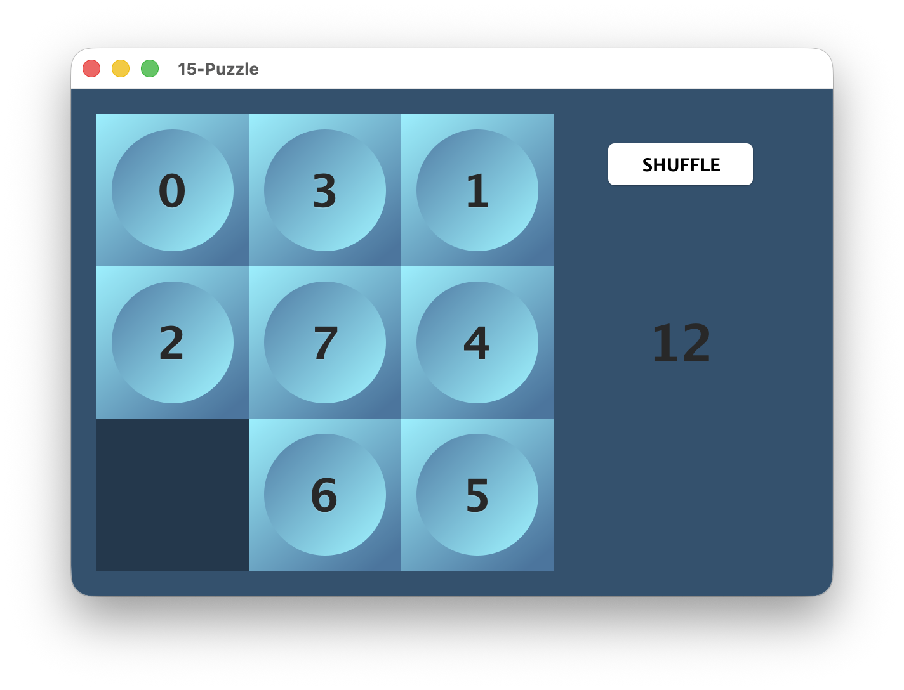

# 15-Puzzle

This is a game I wrote for my Graphical Interfaces class. Main goal was to practice MVC architecture.

## Usage
Once the program is executed, you need to set the size of game

1. Compile the game 
`javac -d out src/*/*.java`
2. Execute main.Main
`java -cp out main.Main`

Have fun!
